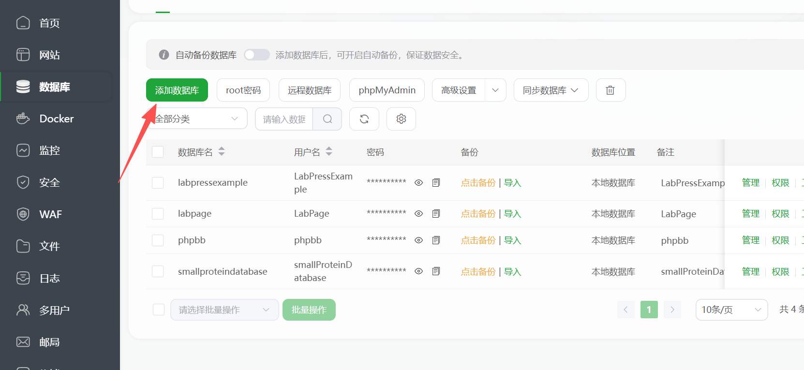
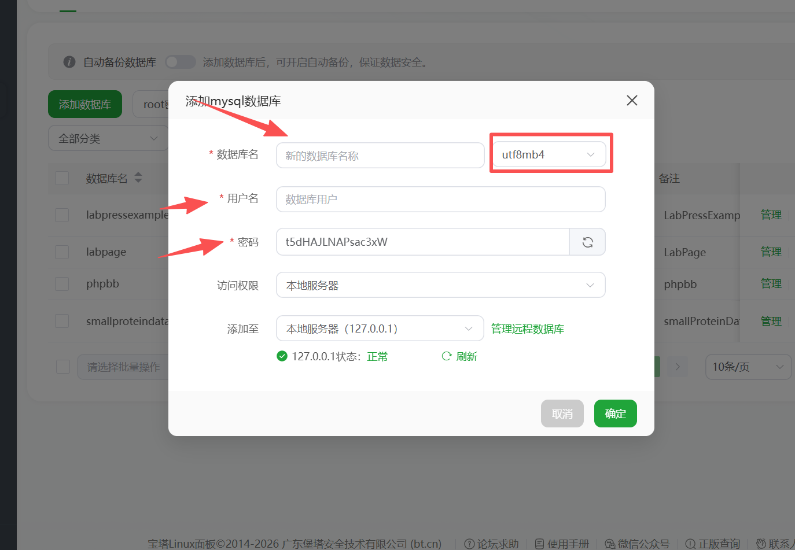
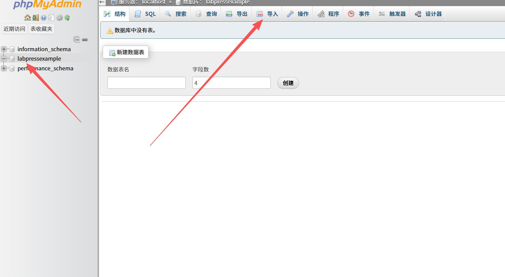
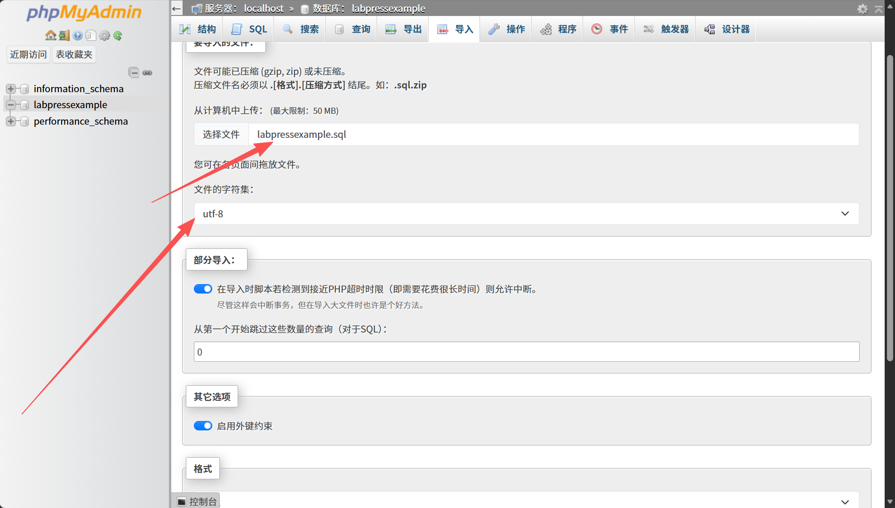
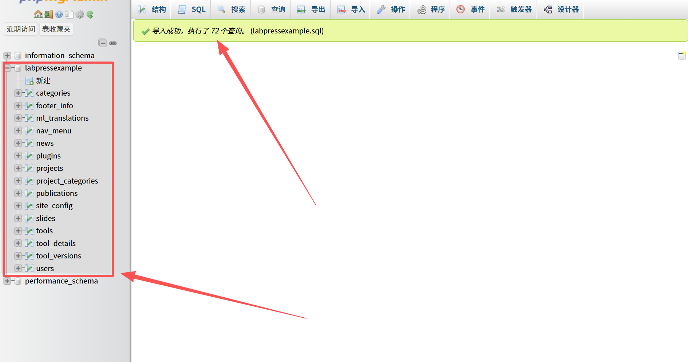
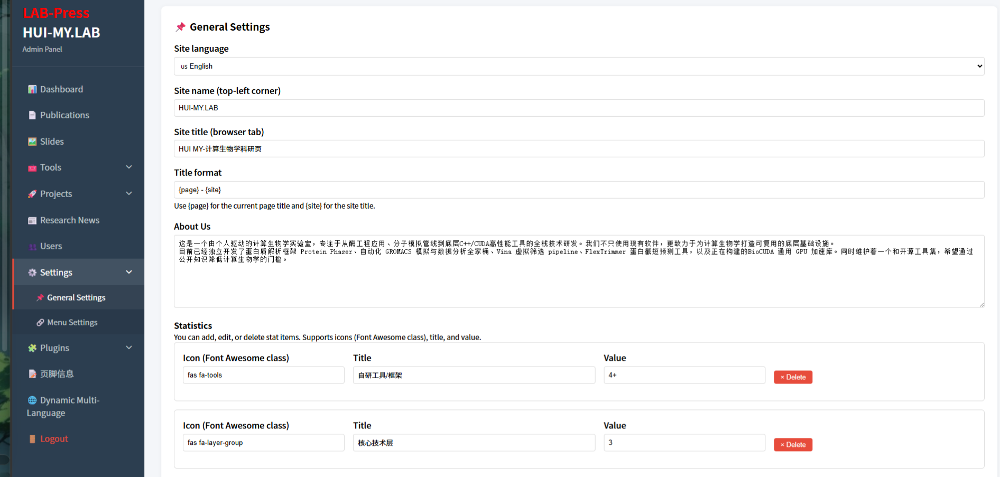

# Installation Guide

This guide provides a detailed, step-by-step procedure for installing LabPress on a typical web server. It covers environment requirements, downloading the source code, creating the database, configuring the database connection, importing the initial data, setting directory permissions, and completing the initial login.

---

## 1. Prerequisites

Before installing LabPress, ensure that your server environment meets the following requirements.

### 1.1 Web Server

Any modern web server that supports PHP can be used:

- Apache 2.4 or higher
- Nginx 1.18 or higher

URL rewriting is not required for the default flat-file routing. If you choose to enable clean URLs later, additional rewrite rules may be needed, but this is optional.

### 1.2 PHP Version

PHP **7.4 or higher** is required.

The following PHP extensions must be enabled:

| Extension   | Required | Purpose                                      |
| ----------- | -------- | -------------------------------------------- |
| `pdo`       | Yes      | Database abstraction layer                   |
| `pdo_mysql` | Yes      | MySQL driver for PDO                         |
| `json`      | Yes      | JSON encoding/decoding for APIs and settings |
| `mbstring`  | Yes      | Multibyte string handling (used by tools)    |
| `session`   | Yes      | User login and permission management         |
| `fileinfo`  | Yes      | File type detection during image upload      |
| `zip`       | Yes      | Plugin ZIP installation                      |

`openssl` is recommended but not strictly required for core functionality. It may be used by other components in the future.

You can verify your PHP configuration by creating a temporary `phpinfo.php` file with the following content and accessing it from a browser:

```php
<?php phpinfo();
```

Remove this file after checking.

### 1.3 Database Server

One of the following:

- MySQL **5.7 or higher**
- MariaDB **10.3 or higher**

LabPress uses the `utf8mb4` character set. If you are using MySQL 5.7, ensure that your server supports `utf8mb4` and that the SQL dump is compatible. The provided `labpressexample.sql` was generated using MySQL 8.0 and may use `utf8mb4_0900_ai_ci` collation. If you are using MySQL 5.7, you may need to replace `utf8mb4_0900_ai_ci` with `utf8mb4_general_ci` before importing.

---

## 2. Downloading LabPress

You can obtain the LabPress source code using **either** of the two methods below. They are equivalent; choose whichever is more convenient for you.

### 2.1 Method 1 : Clone the Repository

You can run the following command :
```bash
git clone https://github.com/GuiHui-huimy/LabPress.git
```

Then move the contents of the `LabPress` directory to your web server's document root.

###  Method 2: Download the ZIP Archive

Download the latest release ZIP from the GitHub repository.[Releases · GuiHui-huimy/LabPress](https://github.com/GuiHui-huimy/LabPress/releases) Extract the archive and upload the extracted files to your web server.

### 2.3 Check your directory

After extraction, the directory should look like this:

```
LabPress/
├── admin/
├── api/
├── assets/
├── includes/
├── languages/
├── plugins/
├── uploads/
├── images/
├── ReadImg/
├── index.php
├── tools.php
├── projects.php
├── publications.php
├── news.php
├── labpressexample.sql
├── .gitignore
├── LICENSE
└── README.md
```

---

## 3. Database Setup and Initial Data Import

LabPress requires a MySQL database. The repository includes a sample SQL dump named `labpressexample.sql`, which creates all required tables and inserts default content. This file does **not** contain a `CREATE DATABASE` statement; you must create an empty database first, then import the SQL file.

Two methods are provided below. **Method 1 (phpMyAdmin) is recommended**, especially if you are using the BaoTa (宝塔) server panel, because it provides a graphical interface and avoids common command-line mistakes.

### Method 1: Using phpMyAdmin (Recommended, especially for BaoTa Panel)

This method is suitable for users who manage their server with the BaoTa panel or any hosting control panel that includes phpMyAdmin.

1. Log in to your BaoTa panel.
2. In the left sidebar, click **Database** (数据库).
3. Click **Add Database** (添加数据库).

   - Set the database name, for example `labpress`.
   - Choose `utf8mb4` as the character set and `utf8mb4_general_ci` as the collation.
   - Create a database user and password, or use an existing one with full privileges.
   
   - Note down the database name, username, and password. You will need them later in `includes/config.php`.
4. After creating the database, find it in the database list and click the **phpMyAdmin** button (or open phpMyAdmin from the panel).
5. In phpMyAdmin, click the database name (`labpress`) in the left sidebar to select it.
6. Click the **Import** (导入) tab at the top.  
7. Under **File to import**, click **Choose File** (选择文件) and select the `labpressexample.sql` file from your computer.
8. Leave the format as **SQL**, then click **Go** (执行) at the bottom.
  
9. Wait for the import to finish. phpMyAdmin will show a success message. All tables and sample data will now be created.

### Method 2: Using the MySQL Command Line

This method is suitable for users who have direct terminal access to the MySQL server.

1. Create a database and user (if not already created). Run the following commands in the MySQL shell:
   ```sql
   CREATE DATABASE labpress CHARACTER SET utf8mb4 COLLATE utf8mb4_general_ci;
   CREATE USER 'labpress_user'@'localhost' IDENTIFIED BY 'your_strong_password';
   GRANT ALL PRIVILEGES ON labpress.* TO 'labpress_user'@'localhost';
   FLUSH PRIVILEGES;
   ```
   If the database already exists, skip this step.

2. Import the SQL file from your terminal:
   ```bash
   mysql -u labpress_user -p labpress < labpressexample.sql
   ```
   You will be prompted for the password. After successful import, the command returns silently.

3. Verify the import by logging into MySQL and checking the tables:
   ```bash
   mysql -u labpress_user -p labpress
   SHOW TABLES;
   ```

Whichever method you choose, make sure the database connection details in `includes/config.php` match the database name, username, and password you used.

---

## 4. Configuring the Database Connection

LabPress reads database credentials from `includes/config.php`. This file is provided with the project and contains the default database connection constants that you must update to match your own environment and your database user information.

### 4.1 Locate the Configuration File and Back up the Configuration File (Optional)

Open the file `includes/config.php` in a text editor. For security, before making changes, you can create a backup copy of the default configuration file.

```bash
#cd to includes directory
cd includes 
#copy the default file to back up
cp config.php config.php.bak
```

### 4.2 Edit the Configuration

Open `includes/config.php` in a text editor and set the following constants:

```php
<?php
session_start();
//Here you need to modify
//1.Your database host location
define('DB_HOST', 'localhost');
//2.Your database name
define('DB_NAME', 'labpress');
//3.Your database user name
define('DB_USER', 'labpress_user');
//4.Your database user password
define('DB_PASS', 'your_strong_password');


//!The following logical code you shouldn't modify!
try {
    $pdo = new PDO(
        "mysql:host=" . DB_HOST . ";dbname=" . DB_NAME . ";charset=utf8mb4",
        DB_USER,
        DB_PASS,
        [
            PDO::ATTR_ERRMODE => PDO::ERRMODE_EXCEPTION,
            PDO::ATTR_DEFAULT_FETCH_MODE => PDO::FETCH_ASSOC,
            PDO::ATTR_EMULATE_PREPARES => false
        ]
    );
} catch (PDOException $e) {
    die("Database Connect Error: " . $e->getMessage());
}
//Time zone configuration
date_default_timezone_set('Asia/Shanghai');
```

- Replace `DB_NAME` with the database you created in the previous step.
- Replace `DB_USER` and `DB_PASS` with the credentials of a user that has full access to that database.
- Keep `DB_HOST` as `localhost` unless your database is hosted remotely.

### 4.3 Important Security Notes
- Do **not** commit or push your own `config.php` file to a public repository if it contains real database credentials.
- Before sharing or publishing your modified project, remove any real database information (database name, username, password) from `config.php`.
- Ensure that `config.php` is excluded from version control. You can add it to `.gitignore` if it is not already listed.

---

## 5. Setting Directory Permissions

LabPress uses several directories for storing uploaded files and plugin packages. These directories must be writable by the web server process. On Linux or macOS systems, the recommended permissions are `755`, which can be applied with the following commands:

```bash
chmod -R 755 uploads/
chmod -R 755 plugins/
chmod -R 755 images/
```

If your web server runs under a dedicated user such as `www-data`, you may also need to adjust file ownership. For Apache servers, this is typically done with:

```bash
chown -R www-data:www-data uploads plugins images
```

On shared hosting environments, `755` is usually sufficient, but some configurations may require `775` if the web server operates as a group user. If you encounter permission-related errors after installation, verify that these directories are writable by the PHP process.

---

## 6. Accessing the Site

Once the database connection has been configured and the necessary permissions have been set, the LabPress frontend can be accessed by opening your web browser and navigating to your domain root:

```
http://your-domain/
```

You should see the homepage populated with the sample slides, project highlights, and publications that were imported from `labpressexample.sql`. If the page appears blank or displays a database connection error, verify the credentials in `includes/config.php` and confirm that the MySQL service is running.


> **Index Page**：Here is LabPress Default Index Page.

The administration panel is available at:

```
http://your-domain/admin
```

The default administrator credentials included in the sample data are:

- **Username**: `root`
- **Password**: `lab123456`

> **Administrator Panel**：Here is LabPress Administrator Panel Setting Page.

For security reasons, you should change this default password immediately after your first login. This can be done from the **Users** management page in the admin sidebar.

---


## 7. Security Recommendations

After installation is complete, keep the following security practices in mind.

Ensure that `includes/config.php` is never publicly accessible. This file contains database credentials and should be protected by the server configuration. Avoid committing `config.php` to a public repository if it contains real credentials. The provided `.gitignore` file may already exclude it, but this should be verified before any code is pushed to a remote repository.

Use HTTPS on all production deployments. A valid SSL certificate protects login credentials and other sensitive data transmitted between the browser and the server. Most hosting control panels, including the BaoTa panel, provide tools for deploying free certificates.

Regularly back up both the web directory and the MySQL database. Database backups are especially important if you plan to update the system or install new plugins. If you discover a security vulnerability, refer to `SECURITY.md` for the proper reporting process.

---

## 8. Troubleshooting Common Installation Issues

The following sections describe some common problems that may occur during installation and how to resolve them.

**Blank Page or Database Connection Error**  
If the frontend or admin panel is blank or displays “Database Connect Error,” check the values in `includes/config.php`. Confirm that the database server is running and that the credentials are correct. You can also create a temporary `phpinfo.php` file to verify that the `pdo_mysql` extension is enabled.

**SQL Import Fails with Collation Error**  
The sample SQL file was exported from MySQL 8.0 and may use `utf8mb4_0900_ai_ci` collation. If you are using MySQL 5.7, import may fail. To resolve this, open `labpressexample.sql` in a text editor and replace all occurrences of `utf8mb4_0900_ai_ci` with `utf8mb4_general_ci` before importing.

**Images Not Displaying**  
If images appear broken, make sure that the `images/` and `uploads/` directories exist and contain the files referenced in the database. The web server must have read access to these directories. If you installed LabPress in a subdirectory, verify that image paths in the database match the actual URL structure.

**Plugin Installation Fails**  
The plugin upload installer requires the PHP `zip` extension. If installation fails, check that this extension is enabled and that the `plugins/` directory is writable. The plugin installation page includes a system environment panel that shows the current status of these requirements.

**Language Switching Does Not Work**  
If the language switcher does not change the interface language, ensure that language files are present in both `languages/zh_CN/` and `languages/en_US/`. For database-stored content translation, the `Dynamic Multi-Language` plugin must be activated. Clearing browser cookies or testing in a private window can also rule out stale language preferences.

---

## 10. Next Steps

After completing the installation, proceed to the [Quick Start](quick-start.md) guide. That guide explains how to create your first publication, project, news item, and customize the homepage content using the administration panel.