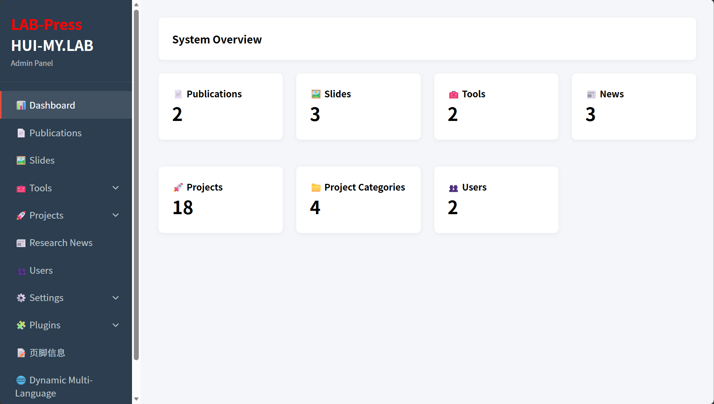
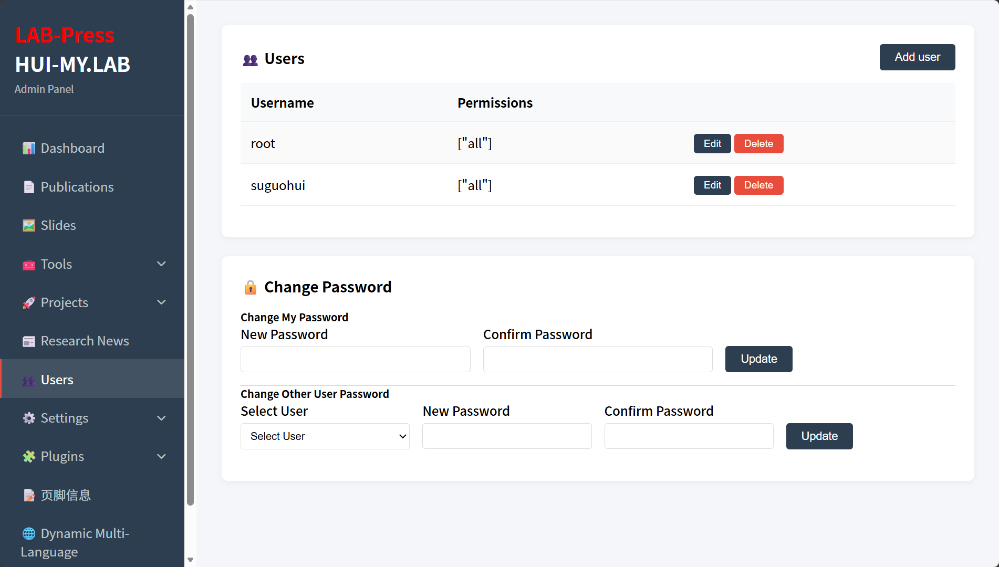
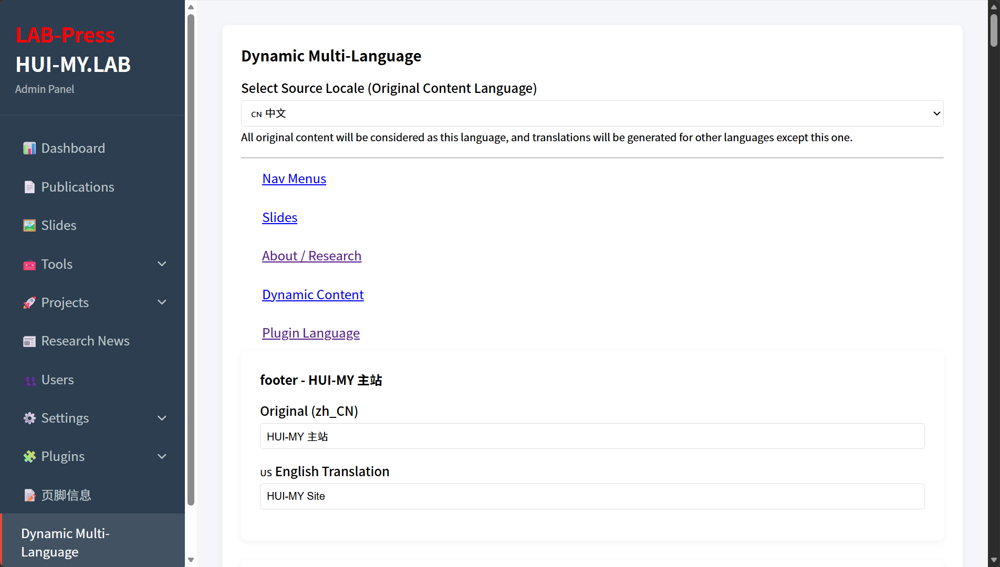

This guide is intended for users who have just completed the installation and want to bring a LabPress site into operation as quickly as possible. It covers only the essential first steps. Detailed configuration options are described in the dedicated chapters later in this documentation.

The instructions assume that LabPress is installed, the sample database has been imported, and the server is running.

## 1. Logging In to the Admin Panel

Open a web browser and navigate to:

```
http://your-domain/admin
```

Use the default administrator credentials provided with the sample data:

- **Username**: `root`
- **Password**: `lab123456`

After a successful login, you will see the admin dashboard with a summary of the current site content.


> **Administrator Panel Dashboard**：Here is LabPress Panel Dashboard , You can also expand the dashboard through plugins.
## 2. Securing the Default Administrator Account

Because the default credentials are public, you should change the default password immediately after your first login. Navigate to **Users** in the admin sidebar and use the password management forms to set a new password for the `root` account, or create a new administrator account and remove the default `root` user.


> **Administrator User Management**：Here is LabPress Panel Dashboard , You can also expand the dashboard through plugins.


For more information on user permissions and account management, refer to the [User Management](../content/users.md) chapter.

## 3. Reviewing Basic Site Settings

Open **Settings > General Settings** to review the site name, browser title, default language, and homepage content such as the “About Us” section, statistics, and research direction cards. The sample data contains default values that you can replace with your own information.


A complete description of every setting is provided in the [Site Settings](../setup/site-settings.md) section.

## 4. Activating Bundled Plugins

LabPress includes two important plugins:

- **FooterInfo** – customizes the footer text and style.
- **Dynamic Multi-Language** – manages translations for database-stored content.

Go to **Plugins > Installed Plugins** and confirm that both plugins are activated. If a plugin is not listed, use the **Scan for new plugins** button.

Details about plugin installation, activation, and management can be found in [Plugin Management](../setup/plugins.md).

## 5. Testing Multilingual Support

The sample data includes both Chinese and English content. Use the language switcher in the frontend navigation to verify that the interface and dynamic content switch correctly. If you need to manage translations, open the **Dynamic Multi-Language** admin page.

For an in-depth explanation of the internationalization system, see the [Internationalization Overview](../i18n/overview.md).

## 6. Managing Content

LabPress provides dedicated admin pages for publications, slides, tools, projects, research news, and users. You can start by editing the sample items or creating new ones. The relevant documentation is located under the **Content Management** section:

- [Publications](../content/publications.md)
- [Slides](../content/slides.md)
- [Tools](../content/tools.md)
- [Projects](../content/projects.md)
- [Research News](../content/news.md)
- [Users](../content/users.md)

## 7. Next Steps

After completing these initial actions, your LabPress site should be ready for regular use. For more advanced configuration, plugin development, and API references, consult the later chapters of this documentation.