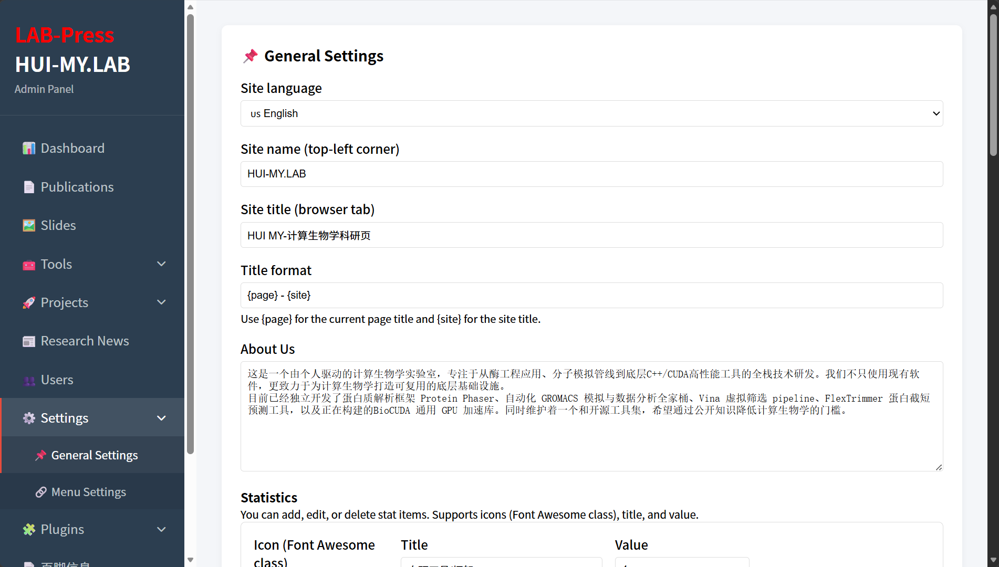

# Site Settings

This chapter provides a detailed reference for the **Settings > General Settings** page in the LabPress administration panel. It describes the purpose of each configuration field, how the data is stored in the database, and how the configured values are rendered on the public website.

The information in this chapter is intended for site administrators who are responsible for maintaining the content and identity of a LabPress installation. It assumes that you are already familiar with the basic concepts introduced in [Basic Configuration](../getting-started/configuration.md).

## 1. Overview

The General Settings page is the central place for configuring the identity and homepage content of a LabPress site. All values edited on this page are stored in the `site_config` table, which is the primary configuration store for business-level settings.

Unlike the environment configuration file `includes/config.php`, which contains database credentials and PHP-level constants, the General Settings page is designed to be edited through the browser without requiring direct file access.

This page provides controls for the following areas:

- Default site language
- Site name and browser title
- Title format
- “About Us” content
- Statistics displayed on the homepage
- Research direction heading, subheading, and cards

> **Administartor General Setting Page**

## 2. Access and Permissions

The General Settings page is available from the admin sidebar under **Settings > General Settings**.

Access to this page requires the `all` user permission. Only administrator accounts with the `all` permission can view or modify the settings. If a user without sufficient permission attempts to open the page, the admin panel displays a permission error.

The permission check is performed at the beginning of the view file:

```php
if (!hasPermission('all')) {
    echo '<div class="card"><p>' . __('no_permission', 'admin') . '</p></div>';
    return;
}
```

This ensures that site identity and content configuration remain restricted to trusted administrators.

## 3. General Settings Fields

The General Settings form is divided into several logical sections. Each section corresponds to one or more entries in the `site_config` table.

### 3.1 Site Language

The **Site Language** field determines the default language of the site.

This setting controls:

- The language used by the admin panel, regardless of frontend language selection.
- The fallback language for the frontend when no user-selected language is available.

The dropdown is populated dynamically from the `languages/` directory. Each language directory that contains a valid `lang.config` file appears as an option. LabPress ships with Chinese (`zh_CN`) and English (`en_US`) language packs by default.

The selected value is stored in the `site_config` table under the key `language`.

If you add a new language pack to the `languages/` directory, it will automatically appear in the dropdown after the next page load.

### 3.2 Site Name and Site Title

Two related fields control the site identity:

| Field | Storage Key | Description |
|-------|-------------|-------------|
| **Site Name** | `site_name` | Short name displayed in the admin sidebar and the footer |
| **Site Title** | `site_title` | Full site title used in the browser title bar |

The site name is typically a concise label such as `HUI-MY.LAB`, while the site title may be a longer descriptive phrase.

The site name is used by the `FooterInfo` plugin as the `{site_name}` placeholder. It is also displayed in the admin panel header.

### 3.3 Title Format

The **Title Format** field controls how page titles are constructed for the browser tab. The value is stored under the key `title_format`.

The default value is:

```
{page} - {site}
```

Two placeholders are supported:

- `{page}` – replaced with the current page title.
- `{site}` – replaced with the site title defined in the **Site Title** field.

For example, if the page title is `Tools` and the site title is `HUI-MY.LAB`, the browser title becomes:

```
Tools - HUI-MY.LAB
```

You can change the order or add separators. For instance, using:

```
{site} | {page}
```

would produce:

```
HUI-MY.LAB | Tools
```

The title format is applied through the `getFullTitle()` function in the core. Plugins can further modify the final title using the `page_title_full` filter.

### 3.4 About Us

The **About Us** field is a large text area that accepts HTML content. It is stored under the key `about_us`.

This content is displayed in the “About Us” section of the homepage. Because the field supports HTML, you can use headings, paragraphs, lists, links, and inline styles.

The homepage template retrieves this value using the configuration system and outputs it inside the about section. If the field is empty, the homepage may fall back to a language-pack string or display nothing, depending on the current template logic.

If you are using the Dynamic Multi-Language plugin, translations for this field can be managed separately in the plugin’s **About / Research** tab.

### 3.5 Statistics

The **Statistics** section allows you to define a set of statistic items that appear on the homepage. Each item consists of three fields:

- **Icon** – a Font Awesome icon class, for example `fas fa-tools`.
- **Label** – the text label displayed beneath the number.
- **Value** – the numeric or textual value displayed as the main statistic.

The data is stored as a JSON-encoded array under the key `stat_items`.

The form provides a dynamic interface for adding and removing statistic rows. When the page is saved, the JavaScript in `admin/assets/js/site-config.js` collects all statistic rows and converts them into a JSON string before submitting the form.

An example stored value is:

```json
[
  {
    "icon": "fas fa-tools",
    "label": "Self-developed Tools",
    "value": "4+"
  },
  {
    "icon": "fas fa-layer-group",
    "label": "Core Technology Layers",
    "value": "3"
  }
]
```

The homepage template loops through the decoded array and renders each item. The `stat_value` filter is applied to the value before output, allowing plugins to modify it.

### 3.6 Research Direction

The **Research Direction** section controls the homepage research area display. It consists of two parts:

1. **Research Title** – the main heading, stored under `research_title`.
2. **Research Subtitle** – a short explanatory text, stored under `research_subtitle`.

In addition, a dynamic list of **Research Direction Cards** is managed using a similar interface to the statistics section. Each card contains:

- **Icon** – a Font Awesome icon or a simple string, for example `flask`.
- **Title** – the card heading.
- **Description** – the card body text.

These cards are stored as a JSON-encoded array under the key `research_cards`.

An example stored value is:

```json
[
  {
    "icon": "flask",
    "title": "Enzyme Engineering",
    "desc": "Rational design workflows for protein engineering."
  },
  {
    "icon": "atom",
    "title": "Molecular Simulation",
    "desc": "Automated MD simulation and virtual screening."
  }
]
```

The homepage template renders these cards in a responsive grid. The icon field is prefixed with `fa-` when the card is displayed, so values should be provided without the `fa-` prefix if they are intended as short names, or with a full Font Awesome class if preferred. The current template assumes the icon is a short name and constructs the class as `fas fa-{icon}`.

## 4. Data Storage and Save Process

When the **Save All Settings** button is clicked, the form data is sent as a JSON request to the API endpoint `api/save.php` with `type` set to `site-config`.

The frontend JavaScript performs the following steps before submission:

- Collects all statistic rows and builds an array of objects.
- Collects all research direction cards and builds an array of objects.
- Converts both arrays into JSON strings.
- Adds the JSON strings to the main data object.
- Sends the complete object to the server.

On the server side, the `site-config` case in `save.php` iterates over each key-value pair in the received data and writes it to the `site_config` table using an `INSERT ... ON DUPLICATE KEY UPDATE` statement:

```php
case 'site-config':
    foreach ($data as $key => $value) {
        $stmt = $pdo->prepare("INSERT INTO site_config (config_key, config_value) VALUES (?, ?) ON DUPLICATE KEY UPDATE config_value = VALUES(config_value)");
        $stmt->execute([$key, $value]);
    }
    break;
```

This ensures that existing keys are updated and new keys are inserted automatically. Because the table uses `config_key` as the primary key, duplicate keys are not created.

The save process is protected by the same permission check as the form. Only users with the `all` permission can call the save endpoint for `site-config`.

## 5. Frontend Rendering

The homepage file `index.php` reads the site configuration at the beginning of the page and uses the values to render the dynamic sections.

For example, the “About Us” section is populated with the value of `about_us`, the statistics section loops through the decoded `stat_items` array, and the research direction section uses `research_title`, `research_subtitle`, and `research_cards`.

The core function `getSiteConfig()` is used to load all configuration values from the `site_config` table. The `LabPress::config()` method provides cached access to individual keys and is used internally by many core components.

Because the admin panel and frontend share the same configuration store, any change made on the General Settings page becomes visible on the public site immediately after the next page load.

## 6. Extensibility Hooks

The site configuration system is integrated with the LabPress hook system. Plugin developers can intercept or modify configuration data using filters and actions.

The most relevant hook is the `translate` filter, which allows the Dynamic Multi-Language plugin to replace database-stored strings with translated versions. For example, the `about_us`, `research_title`, and `research_subtitle` values can be translated through this filter.

Additional generic hooks are triggered during the save process. The `admin_prepare_site-config` filter can be used to modify the data before it is saved, and the `admin_after_site-config_save` action is triggered after a successful save. These hooks are described further in the [Hooks Reference](../plugins/hooks-reference.md).

## 7. Next Steps

After configuring the general site settings, you may want to continue with:

- [Navigation Menus](navigation.md) – manage header and footer menu items.
- [Plugin Management](plugins.md) – activate or install additional plugins.
- [Content Management](../content/publications.md) – create publications, slides, tools, projects, and news.
- [Internationalization](../i18n/overview.md) – manage languages and dynamic translations.
- [Basic Configuration](../getting-started/configuration.md) – review environment and PHP-level settings.